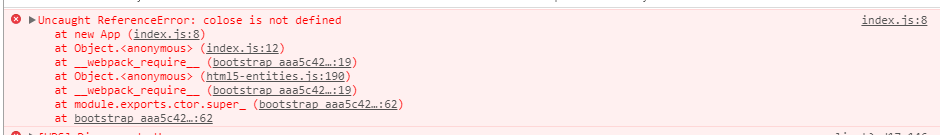

# source map 

本项目在webpack中使用source map，source map可以将编译后的代码映射回原始源代码，参考 [webpack 中文网--指南--开发](https://doc.webpack-china.org/guides/development/#-source-map)


## 在webpack 中配置source map

只需要在配置文件中添加一句：

```js
devtool: 'inline-source-map',
```
打包出来的代码就可以使用source map了。

## 使用项目

1、运行 `npm install` ,安装依赖

2、运行 `npm run build` ，打包代码

3、运行`npm start` ，启动服务器

4、按F12打开调试工具，在输出里就能看到出错信息报的是源码的位置



## 配置webpack-dev-server 使用

使用 webpack-dev-server 如果打开页面没有看到source map的效果，可以按`ctrl+F5`重新加载页面就可以看到了.

在本项目中，可以运行：

```
npm install
npm run build
npm run start-dev
```
看一下效果
