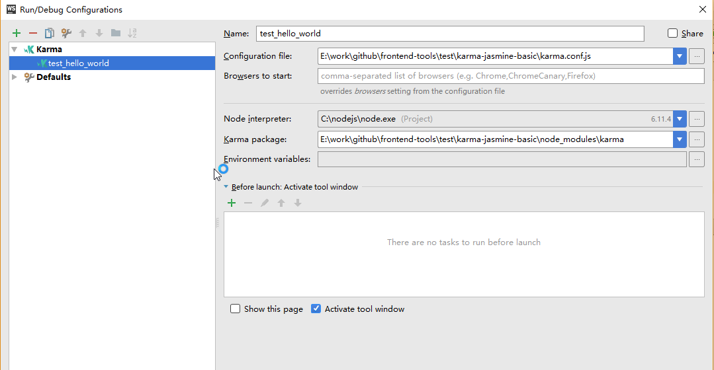

# karma+jasmime基础测试环境

本项目是js基础测试环境，使用karma作为测试框架，用于运行测试用例，使用jasmine作为断言库，提供测试语法支持。
为了支持ES6,还集成了webpack用于打包模块，集成了babel用于编译ES6语法。

## 环境要求

本项目使用chrome浏览器跑测试代码，所以环境中需要有chrome浏览器

## 使用项目

1. 首先安装依赖：

```
npm install
```

2. 编写代码和测试代码

> 代码放在src目录下，测试代码放在test目录下，并且要以.spec.js作为后缀

3、运行测试

```
karma start
```

## 配置webstorm

webstorm可以配置成一键运行测试。打开 [run] --> [edit configurations],点击[+]，选择[Karma],然后按下图进行配置



## 参考链接
1. 集成webpack和babel插件请参考[karma config Preprocessors](https://karma-runner.github.io/1.0/config/preprocessors.html)和[使用 Karma 在真实浏览器上测试](http://csbun.github.io/blog/2015/11/karma/)
1. jasmine 语法参考——[jasmine 2.8 API](https://jasmine.github.io/api/2.8/)